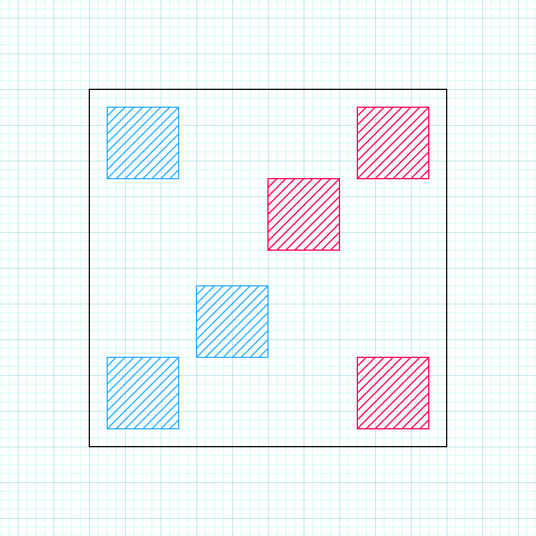

# To-Do for 9/2/2024

## Battlefield

1. Battlefield should be a square with each team on one side. There should be a Backline monster at each corner - the specific distances from the corners are subject to change, depending on various aesthetic factors. Each Frontline monster should start at the center of the square, then one should move slightly back and to the left, while the other goes slightly back and to the right. This is to help distinguish the opposing Frontlines. The field will look roughly like this, with the player's team in blue and their opponent in red:



2. The perspective will be shifted in such a way that your team is at the bottom of the screen, and you see them mostly from their front-right side, and the opponent's team will be a the top, seen mostly from their front-left side. Finally, the battlefield will be tilted, with the opponent's side elevated above your own.

Ultimately, your own backline should be the closest and biggest monsters, with your frontline not far behind. Your opponent's frontline should be their most visible monster, slightly smaller than your own frontline, and the opponent's backline monsters should look very small. The reason the stage is tilted is so you can still see the backline in spite of its size.

Next, the battlefiled UI. I'll leave most of the visuals up to you for now, but we'll need the following data:

- Monster's health - should be represented by a bar above each Monster
- Stage conditions - hazards, terrains, and weather will eventually be animated directly into the stage, but to remove ambiguity, we'll also include icons. Don't worry about specific icons for specific conditoins, just find some clip art of the sun for weather, grass for terrain, and spikes for hazards, and find a good place to group those icons together without obstructing the overall view
- Mana bar - Instead of consumable battle items like Pokemon, we'll be letting our trainer use magic spells, tied to a mana system instead of in-game currency. Find a good place to show the trainer's current mana status.
- Turn menu - The basic menu where you select your action for the time. Your action options are as follows:

```py
turn_menu = {
    "battle": {
        # When choosing to battle, the next option is to select which of your three monsters you want to perform a move.
        #   Hovering over a monster should grant a thick black outline over that monster, and selecting it should have
        #   the camera zoom into that monster and open the select menu for that monster's movepool
        "frontline": {
            # Moves are broken into "attack" moves and "support" moves. Attack moves cannot be used in the backline and
            #   support moves cannot be used in the frontline
            "attack_moves": ["attack1", "attack2", "attack3"],
            "support_moves": ["support1", "support2", "support3"]
        },
        "backline_1": {
            "attack_moves": ["attack1", "attack2", "attack3"],
            "support_moves": ["support1", "support2", "support3"]
        },
        "backline_2": {
            "attack_moves": ["attack1", "attack2", "attack3"],
            "support_moves": ["support1", "support2", "support3"]
        }
    },
    "spells": {
        # Using your pool of mana, the trainer can heal their monsters, buff their monsters, or debuff opposing monsters
        #   Mana does not refill during a battle and each spell has a mana cost, so ration it wisely. Using a spell counts
        #   as an action and ends the user's turn
        "healing": ["heal_spell1", "heal_spell2"],
        "buff": ["buff_spell1", "buff_spell2"],
        "debuff": ["debuff_spell1", "debuff_spell2"]
    },
    "switch": {
        # You can only switch one layer deep, meaning Frontline monsters can swap places with a Backline monster, but not
        #   a party monster. Backline monsters can swap with both Frontline or party monsters. Swapping counts as an action
        #   and will end the user's turn.
        "frontline": ["backline1", "backline2"],
        "backline1": ["frontline", "backline2", "party1", "party2", "party3"],
        "backline2": ["frontline", "backline1", "party1", "party2", "party3"],
    },
    "forfeit": [] # exits the battlefield, no need to implement this yet
}
```

There's no need to program any interactions yet, as we don't have monsters, moves, field mechanics, etc. The goal here is just to set up the battlefield, make sure the UI is integrated, and the turn menu hold all the necessary options, properly branched.
