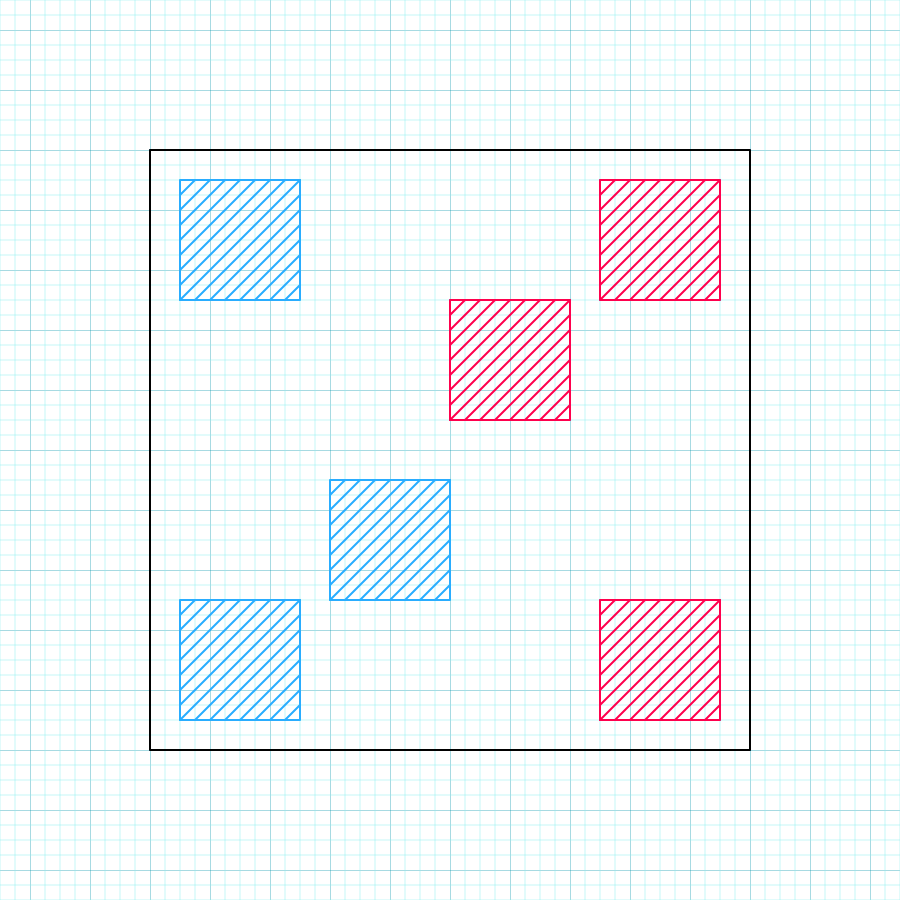

# To-Do for 9/2/2024

## Battlefield

1. Battlefield should be a square with each team on one side. There should be a Backline monster at each corner - the specific distances from the corners are subject to change, depending on various aesthetic factors. Each Frontline monster should start at the center of the square, then one should move slightly back and to the left, while the other goes slightly back and to the right. This is to help distinguish the opposing Frontlines. The field will look roughly like this, with the player's team in blue and their opponent in red:

